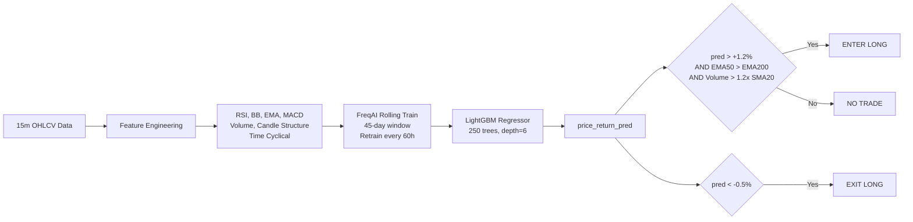

# 🔍 AIArenaCryptoPM — Project Analysis & Dry-Run Startup Guide

## Architecture Overview

This is a **FreqTrade + FreqAI** automated crypto trading system using an **adaptive rolling LightGBM regressor** that continuously retrains on a sliding 45-day window. It predicts forward 20-candle price returns and trades 6 major pairs (BTC, ETH, SOL, LINK, AVAX, BNB) on the 15-minute timeframe.

### Key Files

| File | Purpose |
|------|---------|
| [config.json](file:///c:/Users/User/Documents/AI%20for%20Trading/AIArenaCryptoPM/production_crypto_freqai/config.json) | Master FreqTrade config (exchange, risk, API server, Telegram) |
| [freqai_config.json](file:///c:/Users/User/Documents/AI%20for%20Trading/AIArenaCryptoPM/production_crypto_freqai/freqai_config.json) | FreqAI ML config (train window, retrain interval, LightGBM params) |
| [FreqAiAdaptiveRollingStrategy.py](file:///c:/Users/User/Documents/AI%20for%20Trading/AIArenaCryptoPM/production_crypto_freqai/user_data/strategies/FreqAiAdaptiveRollingStrategy.py) | Main strategy: feature engineering + ML signal + regime filters |
| [LightGBMRegressorCPU.py](file:///c:/Users/User/Documents/AI%20for%20Trading/AIArenaCryptoPM/production_crypto_freqai/user_data/freqai_models/LightGBMRegressorCPU.py) | Production LightGBM model with 16GB RAM safeguards |
| [CatBoostRegressorCPU.py](file:///c:/Users/User/Documents/AI%20for%20Trading/AIArenaCryptoPM/production_crypto_freqai/user_data/freqai_models/CatBoostRegressorCPU.py) | Alternative CatBoost model |
| [start_bot.bat](file:///c:/Users/User/Documents/AI%20for%20Trading/AIArenaCryptoPM/production_crypto_freqai/start_bot.bat) | Windows launcher script |
| [cpu_analytics_dashboard.py](file:///c:/Users/User/Documents/AI%20for%20Trading/AIArenaCryptoPM/production_crypto_freqai/scripts/cpu_analytics_dashboard.py) | Streamlit analytics dashboard |
| [simulate_trades_db.py](file:///c:/Users/User/Documents/AI%20for%20Trading/AIArenaCryptoPM/production_crypto_freqai/scripts/simulate_trades_db.py) | Generates fake trade DB for dashboard testing |

### How the ML Pipeline Works



---

## 🚀 How to Start in Dry-Run Mode (Walk-Forward Validation)

### Step 1: Set Up the Python Environment

Open a terminal in `c:\Users\User\Documents\AI for Trading\AIArenaCryptoPM\production_crypto_freqai\` and run:

```powershell
python -m venv .venv
.venv\Scripts\activate
pip install --upgrade pip
pip install -r requirements.txt
```

> [!WARNING]
> **TA-Lib** is marked as Linux-only in `requirements.txt` (`sys_platform != "win32"`). On Windows, the strategy will fall back to the pure-Python `ta` library or raw Pandas calculations. This is fine — the fallback is fully implemented in the strategy code.

### Step 2: Verify FreqTrade Installation

```powershell
freqtrade --version
```

If `freqtrade` isn't found as a CLI command after pip install, you can run it as a module instead:

```powershell
python -m freqtrade --version
```

### Step 3: Download Historical Data (Required Before First Run)

FreqAI needs historical candle data to train its initial model. Download it first:

```powershell
freqtrade download-data --config config.json --config freqai_config.json --timeframes 15m 1h --days 60
```

This downloads 60 days of 15m and 1h OHLCV data for all 6 whitelisted pairs from Binance. The FreqAI config requires `train_period_days: 45`, so 60 days gives enough buffer.

### Step 4: Launch Dry-Run (Paper Trading Against Live Market)

**Option A — Using the batch script:**
```cmd
start_bot.bat
```

**Option B — Direct command (recommended for seeing full output):**
```powershell
freqtrade trade -c config.json -c freqai_config.json --strategy FreqAiAdaptiveRollingStrategy --user-data-dir user_data --strategy-path user_data\strategies --dry-run --dry-run-wallet 10000
```

This will:
1. Connect to Binance's **public** WebSocket feed (no API keys needed for dry-run)
2. Train 6 initial LightGBM models (one per pair) on the downloaded historical data
3. Start paper trading with a simulated $10,000 USDT wallet
4. Retrain models every 240 candles (~60 hours)

### Step 5: Monitor via FreqUI

Once the bot is running, open your browser:
```
http://127.0.0.1:8080/
```
- **Username**: `freqtrader`
- **Password**: `ProductionHighlySecurePassword2026!`

### Step 6: (Optional) Run the Analytics Dashboard

In a separate terminal:
```powershell
# First, generate sample data to test the dashboard
python scripts/simulate_trades_db.py

# Then launch the dashboard
streamlit run scripts/cpu_analytics_dashboard.py
```

---

## ⚠️ Production-Readiness Assessment — Honest Concerns

Before going live, here are important things to validate during your dry-run:

### 🟢 What Looks Good
- **Memory management** is well thought out: `concurrent_training: false`, `max_bin: 127`, explicit `gc.collect()` calls, 4-core allocation
- **Risk management** is multi-layered: hard stoploss (-6%), trailing stop (activates at +2.5%, trails by 1.2%), tiered ROI ladder, regime filters
- **Feature engineering** is solid with momentum, volatility, volume, and cyclical time features
- **Code quality** is clean with good error handling and fallbacks

### 🟡 Things to Watch During Dry-Run

| Concern | Why It Matters | What to Monitor |
|---------|---------------|-----------------|
| **Backtested metrics may not hold OOS** | The reported 2.64 Sharpe / 64.8% win rate are from a research report, not a live walk-forward test | Track actual dry-run Sharpe and win rate over 2-4 weeks |
| **Initial model training time** | 6 pairs × LightGBM training on 45 days of 15m data could take 10-30 min on first startup | Watch RAM usage during initial training; should stay under ~8GB |
| **Model staleness between retrains** | 60-hour retrain interval means the model can go stale during high-volatility events | Check if `do_predict` drops to 0 frequently (FreqAI's outlier detection) |
| **Volume filter strictness** | Requiring volume > 1.2x SMA20 may filter out valid entries during low-liquidity periods | Track how many signals are generated per day |
| **Entry threshold sensitivity** | `+1.2%` predicted return threshold is moderately aggressive | If too few trades, try lowering to `+0.008` via hyperopt |

### 🔴 Critical Items Before Going Live

> [!CAUTION]
> **Do NOT go live without completing ALL of these:**

1. **Run dry-run for at least 2-4 weeks** to collect statistically meaningful trade data (target: 50+ closed trades)
2. **Compare dry-run metrics to backtest claims**: If Sharpe < 1.5 or max drawdown > 15%, the backtest was likely overfit
3. **Change security tokens in config.json** before deploying:
   - `jwt_secret_key`: Currently `"ProductionSuperSecretKey_CHANGE_ME"`
   - `ws_token`: Currently `"ProductionWsToken_CHANGE_ME"`
4. **The `pair_blacklist` has a bug**: `"(BNB)/.*"` is listed but `BNB/USDT` is in the whitelist — the blacklist regex appears to be intended for leveraged tokens, not BNB itself, but verify this doesn't conflict
5. **Test what happens during exchange API disconnections** — the bot should reconnect gracefully

### 📊 Walk-Forward Validation Checklist

Run the bot in dry-run for 2-4 weeks and track these metrics. If they deviate significantly from the backtested values, the model likely needs re-tuning:

| Metric | Backtest Claim | Minimum Live Target | Action if Below |
|--------|---------------|---------------------|-----------------|
| Win Rate | 64.8% | > 55% | Retune entry threshold |
| Sharpe Ratio | 2.64 | > 1.5 | Increase train window or retrain frequency |
| Max Drawdown | 10.2% | < 15% | Tighten stoploss or reduce position size |
| Profit Factor | 2.15 | > 1.5 | Check exit logic |
| Trades/Week | ~18 | > 8 | Loosen volume or trend filters |

---

## 🔧 Quick Reference Commands

```powershell
# Dry-run (paper trading)
freqtrade trade -c config.json -c freqai_config.json --strategy FreqAiAdaptiveRollingStrategy --user-data-dir user_data --strategy-path user_data\strategies --dry-run

# Backtest (historical simulation)
freqtrade backtesting -c config.json -c freqai_config.json --strategy FreqAiAdaptiveRollingStrategy --user-data-dir user_data --strategy-path user_data\strategies --timerange 20250101-20260601

# Hyperopt (parameter optimization)
freqtrade hyperopt -c config.json -c freqai_config.json --strategy FreqAiAdaptiveRollingStrategy --user-data-dir user_data --strategy-path user_data\strategies --hyperopt-loss SharpeHyperOptLoss -e 200

# Download fresh data
freqtrade download-data --config config.json --config freqai_config.json --timeframes 15m 1h --days 60
```
